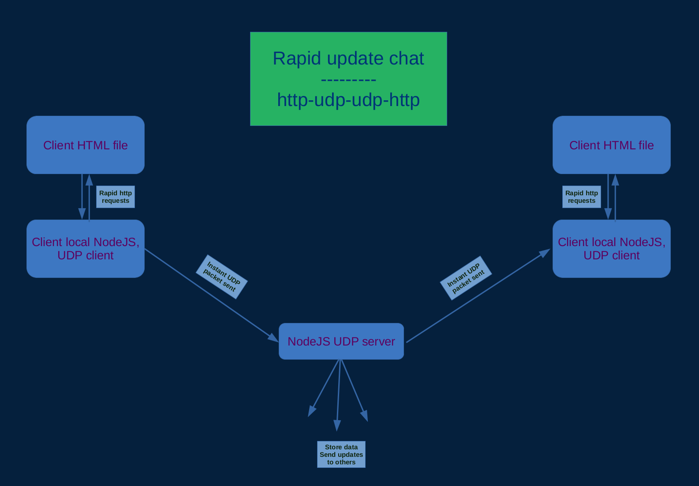

# CBot
Rapid update http-to-udp chat bot and server

This is a variation on a chat system that's a cross between ip/port relay chat and modern http requests based web chat.

The trouble with a strict http request based server is it relies on polling so the server gets a lot of unnecessary traffic.  It would be nice if the server just sent an update to all it's clients only when it's requested to be changed.

I had thought of doing this with http2 server push but I'm not sure it would fit exactly in this scenario.

The idea here is each client gets it's own copy of NodeJS and the chat client-server interaction is all done via fast UDP update packets, so the responses are realtime.

The client also includes a local html file to access it's own server on localhost which is rapidly polled for changes.  Changes which will come in via fast UDP update packets.  This can be between 10 and 100 times a second for what looks like realtime multiscreen typing across different systems on a network.  This rapid polling should not incur any cost to network peformance as it happens strictly on localhost while network traffic is strictly UDP.  UDP happens very quickly - on the order of microseconds and is not a request-reply scenario making it virtually instant.  A single UDP packet can be 8k in size, so either large updates could be sent or the ENTIRE contents of a shared text window could be resent on keystroke if it's size is limited (perhaps netween 200 - 8000 bytes).

The only thing the client must do is run node CBot_client.js and open CBot.html.  This is a work in progress / an idea I had.  This would be a nice collaboration tool for local networks who want to operate with their own server - not relying on a cloud, with this light-weight tool.

The request flow should look something like this...

Client HTML -> (HTTP) <-> NodeJS localhost -> (UDP) -> NodeJS Server -> (UDP) -> NodeJS localhost #2 <-> (HTTP) -> Client HTML #2

Here's a diagram of what that might look like...

Note:  There are no dependencies in this project - except NodeJS and the browser itself.

To get NodeJS...

Windows users:
  winget install nodejs

Linux users:
  apt install nodejs

    (your package manager may vary)
